  <h1>한지우 OpMAY</h1>
  
FullStack Developer & 3D Web Enthusiast

  

 

  <h3>🧑‍💻 PROFILE</h3>

<ul>
  <li>🎓 <b>세종대학교 전자정보통신공학과 졸업</b> (2015~2022)</li>
  <li>💼 <b>스타트업(오키위) 백엔드 개발자</b> (2021.06 ~ 2022.12)</li>
  <li>💼 <b>VRAPoint 백엔드 개발자</b> (2023.08 ~ 현재)</li>
</ul>

 

  <h3>🚀 ONGOING & INTERESTS</h3>

<ul>
  <li>🎮 <b>사내 3D 파이프라인 및 툴 개발</b> : <code>Unreal Engine</code>과 <code>3ds Max</code>를 연동한 사내 파이프라인 구축 및 고도화 (<code>C++</code>, <code>Python</code> 활용)</li>
  <li>🖥️ <b>크로스 플랫폼 앱 개발</b> : Chrome 등 웹 브라우저 환경을 넘어 <code>Electron</code>을 활용한 데스크톱 애플리케이션 개발</li>
  <li>🎵 <b>웹 서비스 구축 및 아키텍처 설계</b> : <code>Next.js 16</code>, <code>Tailwind CSS 4</code> 기반 풀스택 및 <code>NestJS</code>, <code>FastAPI</code>를 활용한 견고한 백엔드 구축</li>
  <li>🌐 <b>3D 뷰어 성능 최적화</b> : <code>Three.js</code> 최적화 및 <code>WebGPU</code> 기반 렌더링 아키텍처 고도화</li>
</ul>

 

  <h3>📊 GITHUB STATS</h3>

  
  

 

  <h3>🛠 TECH STACK</h3>

  

   
  
  
  
  

 

  

   
  
  
  
  
  
  
  

 

  

   
  
  
  
  

 

  

   
  
  
  
  
  

 

  

   
  
  
  
  
  

 

  

   
  
  
  
  
  
  
  

